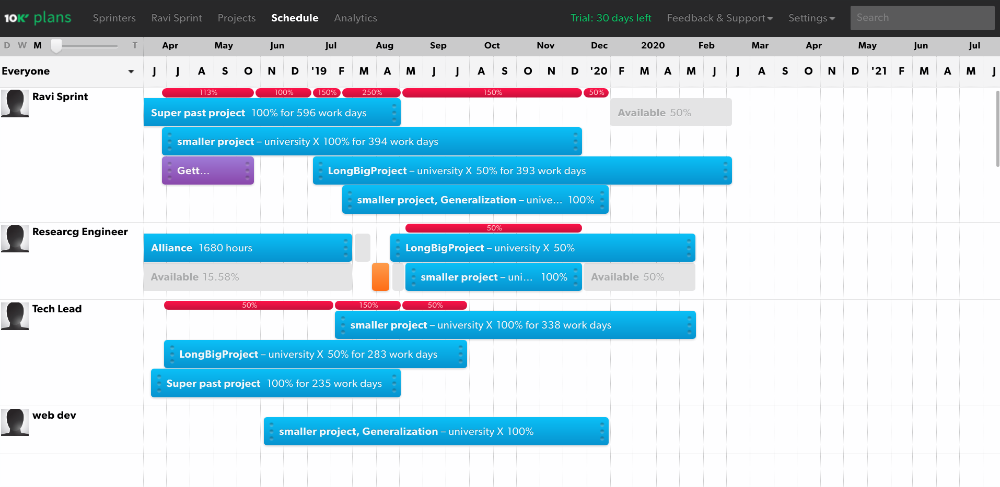
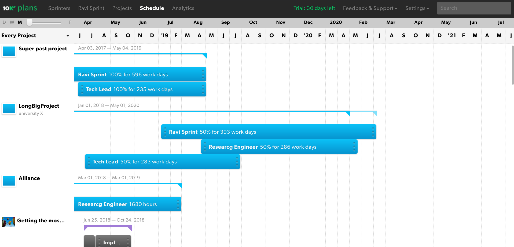
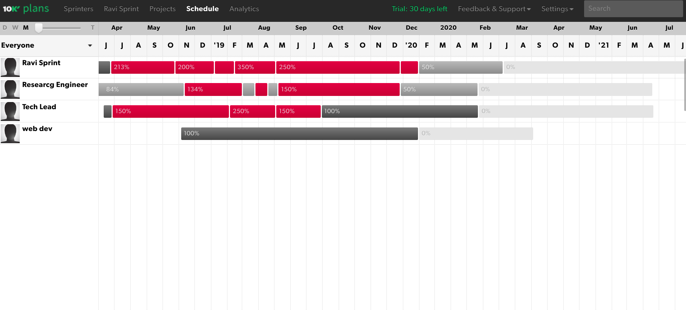

# 10000ft

URL: [10Kft](https://www.10000ft.com/resource-planning)

## Connclusion:

possbile match. 

## Test results

Missing over / under planning and allocation.
How to integrate (ie. upload actual hours) with exact? 

More indepth testing issues:
 * assignment cannot span holidays, so need to un-assign and re assigne people for breaks. If not, then the utilitzation etc. will be off by the holiday amount
 * unclear how to import written hours

## Screen shots

